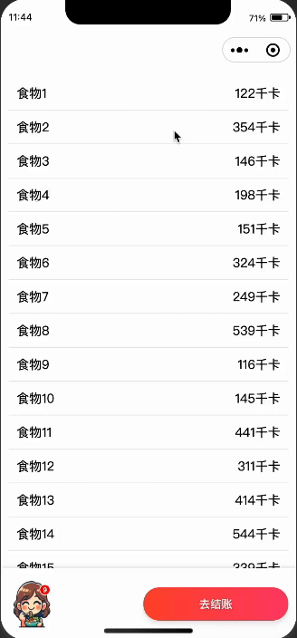
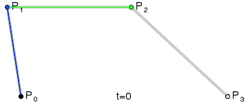

因为最近在做一个添加购物车的页面,涉及到贝塞尔曲线绘制技术,在用户点击添加到购物车时，会出现一个小球从点击位置飞向购物车图标的位置，模拟商品被添加到购物车的动画效果。



与是网上查阅资料,下面简单介绍下关于贝塞尔曲线的一些原理知识。

贝塞尔曲线通过一组控制点来定义其形状。最常见的贝塞尔曲线是二次和三次贝塞尔曲线。下面通过图文介绍其原理。

#### 1. 二次贝塞尔曲线

二次贝塞尔曲线由三个点定义：起点 P0、控制点 P1 和终点 P2。曲线的方程如下：

B(t)=(1−t)2P0+2(1−t)tP1+t2P2B(t) = (1 - t)^2 P0 + 2(1 - t)t P1 + t^2 P2B(t)=(1−t)2P0+2(1−t)tP1+t2P2

其中 ttt 是一个从 0 到 1 的参数，控制曲线从 P0 移动到 P2。


*图1：二次贝塞尔曲线*

#### 2. 三次贝塞尔曲线

三次贝塞尔曲线由四个点定义：起点 P0、两个控制点 P1 和 P2、以及终点 P3。曲线的方程如下：

B(t)=(1−t)3P0+3(1−t)2tP1+3(1−t)t2P2+t3P3B(t) = (1 - t)^3 P0 + 3(1 - t)^2 t P1 + 3(1 - t) t^2 P2 + t^3 P3B(t)=(1−t)3P0+3(1−t)2tP1+3(1−t)t2P2+t3P3

同样，ttt 是一个从 0 到 1 的参数。



*图2：三次贝塞尔曲线*

### 贝塞尔曲线的构建步骤

以三次贝塞尔曲线为例：

1. **线性插值**：从 P0 到 P1、从 P1 到 P2 和从 P2 到 P3 进行线性插值，生成新的点 Q0、Q1 和 Q2。
2. **二次插值**：对 Q0 到 Q1 和 Q1 到 Q2 进行线性插值，生成新的点 R0 和 R1。
3. **三次插值**：对 R0 到 R1 进行线性插值，生成最终的贝塞尔曲线点 B(t)。

通过这个过程，贝塞尔曲线的形状由控制点决定，不同的控制点位置会生成不同形状的曲线。

### 贝塞尔曲线的应用

1. **矢量图形设计**：贝塞尔曲线广泛应用于矢量图形软件（如 Adobe Illustrator 和 CorelDRAW）中，用于绘制平滑的曲线和形状。
2. **动画**：贝塞尔曲线用于描述物体的运动路径，使动画看起来更加自然和流畅。
3. **UI设计**：在 UI 设计中，贝塞尔曲线用于定义过渡动画，使界面交互更加生动。

### 贝塞尔曲线的优点

- **平滑性**：通过调整控制点，可以绘制非常平滑的曲线。
- **可控性**：控制点的位置直接影响曲线的形状，便于设计师精确调整。
- **效率高**：计算贝塞尔曲线的点只需要简单的线性插值操作，计算效率高。

### 组件目录
```perl
parabola-ball/
├── components/
│   ├── parabola-ball/
│   │   ├── index.js
│   │   ├── index.wxml
│   │   ├── index.wxss
│   │   └── index.json
├── pages/
│   ├── index/
│   │   ├── index.js
│   │   ├── index.wxml
│   │   ├── index.wxss
│   │   └── index.json
├── app.js
├── app.json
├── app.wxss
└── README.md

```

### 组件介绍
index.js
```js
observers: {
    'startX, startY': function(startX, startY) {
      let style = `--startX:${startX}px;--startY:${startY}px;--endX: ${this.data.endX};--endY: ${this.data.endY};`;
      this.setData({
        style
      });
    }
  }
```

index.wxml
```html
<view class="container animation" wx:if="{{show}}" style="{{style}}" bindanimationend="onAnimaEnd">
</view>
```
- `show`:是否展示动画。
- `onAnimaEnd`:动画结束的回调函数。

index.wxss
```css
.animation {
  animation-fill-mode: forwards;
  animation: top-y 0.3s cubic-bezier(0, 0.3, 0.3, 1) forwards, 
             drop-y 0.4s cubic-bezier(0.7, 0, 1, 0.7) 0.3s forwards,
             scale-size 0.3s cubic-bezier(0.48, 0.33, 0.24, 1.18) 0.3s forwards, 
             throwX 0.7s linear forwards, 
             show-hide 0.7s linear forwards;
}
```

css主要是cubic-bezier()来定义贝塞尔曲线的函数,其他是一些基本的动画和样式,该函数一共四个参数,可以结合以上内容理解P0和P3的关系,也可以使用[cubic-bezier](https://cubic-bezier.com) 一个神奇的可视化交互工具,可以通过拖动来控制动画的形状,感兴趣的可以去看一下。

### 使用方式
1. **引入组件**

在页面的 JSON 文件中引入 `parabola-ball` 组件。

```json
{
  "usingComponents": {
    "ball": "/components/parabola-ball/index"
  }
}
```

1. **在页面中使用组件**

在页面的 WXML 文件中使用 `parabola-ball` 组件。

```xml

<view class="page">
  <-你的组件->
  <ball 
    show="{{show}}" 
    startX="{{startX}}" 
    startY="{{startY}}" 
    bind:animationHasDone="handleAnimationEnd">
  </ball>
</view>
```

1. **页面逻辑**

在页面的 JS 文件中实现逻辑控制，包括点击事件处理和动画完成处理。

```javascript

Page({
  data: {
    dataList: [],
    addList: [],
    show: false,
    endX: '15vw',
    endY: '92vh'
  },

  onLoad: function () {
    let list = this.generateTestData(20);
    this.setData({
      dataList: list
    });
  },

  generateTestData(count) {
    const testData = [];
    for (let i = 1; i <= count; i++) {
      testData.push({
        id: `${i}`,
        text: `食物${i}`,
        info: {
          "能量": `${Math.floor(Math.random() * 500) + 50}千卡`,
        },
      });
    }
    return testData;
  },

  onItemTap(event) {
    const item = event.currentTarget.dataset.item;
    const { clientX, clientY } = event.touches[0];
    this.setData({
      showBall: true,
      position: {
        startX: clientX,
        startY: clientY
      }
    });
  },

  onAnimationHasDone() {
    this.setData({
      showBall: false
    });
  },

  onAddToCart() {
    const { currentFood, addList } = this.data;
    if (!addList.some(item => item.id === currentFood.id)) {
      addList.push(currentFood);
      this.setData({
        addList
      });
    }
  }
});
```

